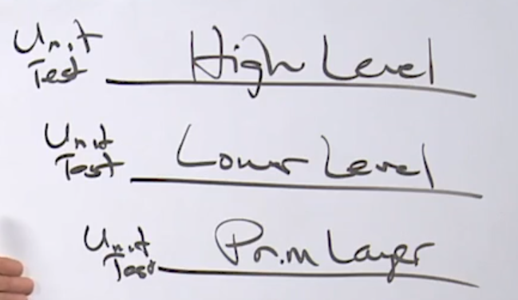

* Remember problems are solved in the concrete not in the abstract, so we need concrete implementations, solutions first in order to know how to decouple.This is gonna simplify your code and allow you focus on what's important which is the problem and remember problem is the data.
* How do you know when you done a piece of code ? 
    * For me done comes with two different answers
        * The first one is, you really have gotta make sure that you have unit tests.You've gotta have some level of test coverage.For me overall I want to see 70-80% test coverage before you can come to me and say you're done.
        * The other part of the answer of this question, is the code decoupled from the change we expect to happen ? 
            * Remember you're writing code for today, design and architect for tomorrow.
            * So deciding to decouple may or may not happen immediately but i wanna ask the question, do we know what has to be decoupled and do we wanna do that ? I can ask this question because decoupling is part 2 of everything I do, it is refactoring.We saw problems in the concrete first, we refactor into the decoupling.
---
 
* Code that is testable usually means the data that we're passing in is reproducible on data coming out.
* Remember! 
    * Testability is about the data, the code we're writing is about the data, decoupling is about the data, the problem you're trying to solve is about the data.             
* As we start write more code, you're gonna see me focus on
    * What are the real problems in front of us
    * How do we layer this API, not only so usable but testable.It doesn't mean we need interfaces, we need strong inputs and outputs around the data that we can test against.
    * How do we refactor code to then deal with change once we have concrete solution.  
---

            